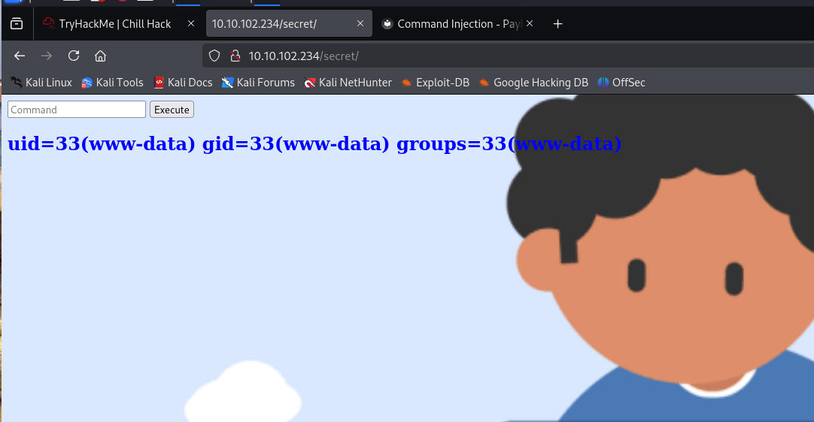

# Chill Hack - TryHackMe

- Objetivo: Obtener acceso al sistema y escalar privilegios hasta root.
- Fecha: 16/06/2025
- Autor del reto: Liiaam251
- Enlace a la máquina: [https://tryhackme.com/room/chillhack](https://tryhackme.com/room/chillhack)
- IP de la máquina: 10.10.42.200

## Enumeración de puertos con Nmap
````
$ nmap -p- --open -sS -sV -sC -T4 -n -Pn 10.10.42.200
Starting Nmap 7.94SVN ( https://nmap.org ) at 2025-06-16 09:45 EDT
Nmap scan report for 10.10.42.200
Host is up (0.051s latency).
Not shown: 65111 closed tcp ports (reset), 421 filtered tcp ports (no-response)
Some closed ports may be reported as filtered due to --defeat-rst-ratelimit
PORT   STATE SERVICE VERSION
21/tcp open  ftp     vsftpd 3.0.5
| ftp-syst: 
|   STAT: 
| FTP server status:
|      Connected to ::ffff:10.9.3.53
|      Logged in as ftp
|      TYPE: ASCII
|      No session bandwidth limit
|      Session timeout in seconds is 300
|      Control connection is plain text
|      Data connections will be plain text
|      At session startup, client count was 4
|      vsFTPd 3.0.5 - secure, fast, stable
|_End of status
| ftp-anon: Anonymous FTP login allowed (FTP code 230)
|_-rw-r--r--    1 1001     1001           90 Oct 03  2020 note.txt
22/tcp open  ssh     OpenSSH 8.2p1 Ubuntu 4ubuntu0.13 (Ubuntu Linux; protocol 2.0)
| ssh-hostkey: 
|   3072 25:39:69:a4:a1:49:28:0a:5f:b9:ee:eb:4f:b8:41:a2 (RSA)
|   256 b3:59:5b:aa:42:e1:23:29:33:67:e1:26:93:89:a8:b8 (ECDSA)
|_  256 6c:b4:d5:35:c1:42:66:28:9d:8d:31:6d:e7:a5:35:88 (ED25519)
80/tcp open  http    Apache httpd 2.4.41 ((Ubuntu))
|_http-title: Game Info
|_http-server-header: Apache/2.4.41 (Ubuntu)
Service Info: OSs: Unix, Linux; CPE: cpe:/o:linux:linux_kernel

Service detection performed. Please report any incorrect results at https://nmap.org/submit/ .
Nmap done: 1 IP address (1 host up) scanned in 26.13 seconds
````
## FTP - Anonymous
Entramos al ftp a ver que hay:
````
tp 10.10.42.200                                         
Connected to 10.10.42.200.
220 (vsFTPd 3.0.5)
Name (10.10.42.200:kali): Anonymous
331 Please specify the password.
Password: 
230 Login successful.
````
````
ftp> ls -la
229 Entering Extended Passive Mode (|||50078|)
150 Here comes the directory listing.
drwxr-xr-x    2 0        115          4096 Oct 03  2020 .
drwxr-xr-x    2 0        115          4096 Oct 03  2020 ..
-rw-r--r--    1 1001     1001           90 Oct 03  2020 note.txt
226 Directory send OK.
ftp> mkdir .ssh
550 Permission denied.
ftp> get note.txt
````
Vamos a ver que hay dentro de esta nota:
````
$ cat note.txt
Anurodh told me that there is some filtering on strings being put in the command -- Apaar
````
Pero de momento no nos dice mucho, vamos a enumerar http:

## Enumeración http:
````
$ gobuster dir -u http://10.10.102.234 -w /home/kali/Downloads/subdomains-top1mil-20000.txt -x html,php,txt -t 50
===============================================================
Gobuster v3.6
by OJ Reeves (@TheColonial) & Christian Mehlmauer (@firefart)
===============================================================
[+] Url:                     http://10.10.102.234
[+] Method:                  GET
[+] Threads:                 50
[+] Wordlist:                /home/kali/Downloads/subdomains-top1mil-20000.txt
[+] Negative Status codes:   404
[+] User Agent:              gobuster/3.6
[+] Extensions:              txt,html,php
[+] Timeout:                 10s
===============================================================
Starting gobuster in directory enumeration mode
===============================================================
/blog.html            (Status: 200) [Size: 30279]
/news.html            (Status: 200) [Size: 19718]
/images               (Status: 301) [Size: 315] [--> http://10.10.102.234/images/]
/css                  (Status: 301) [Size: 312] [--> http://10.10.102.234/css/]
/js                   (Status: 301) [Size: 311] [--> http://10.10.102.234/js/]
/team.html            (Status: 200) [Size: 19868]
/contact.php          (Status: 200) [Size: 0]
/contact.html         (Status: 200) [Size: 18301]
/about.html           (Status: 200) [Size: 21339]
/index.html           (Status: 200) [Size: 35184]
/secret               (Status: 301) [Size: 315] [--> http://10.10.102.234/secret/]
Progress: 80000 / 80004 (100.00%)
===============================================================
Finished
````
Lo que más me llama la atención es el /secret vamos dentro para ver que hay:

